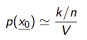
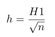
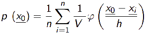
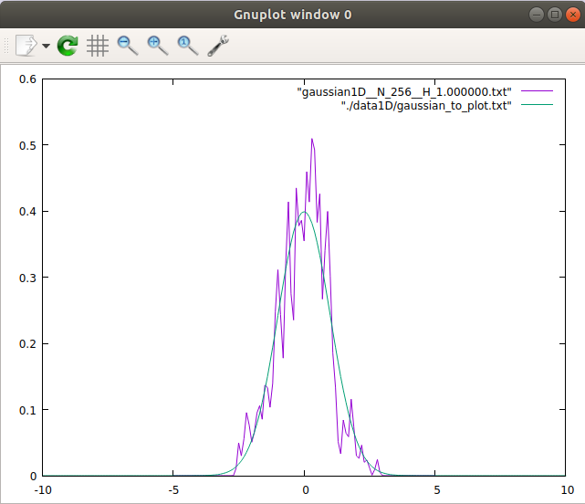
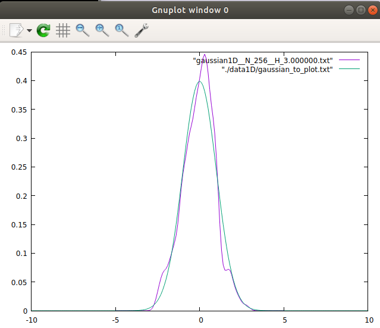
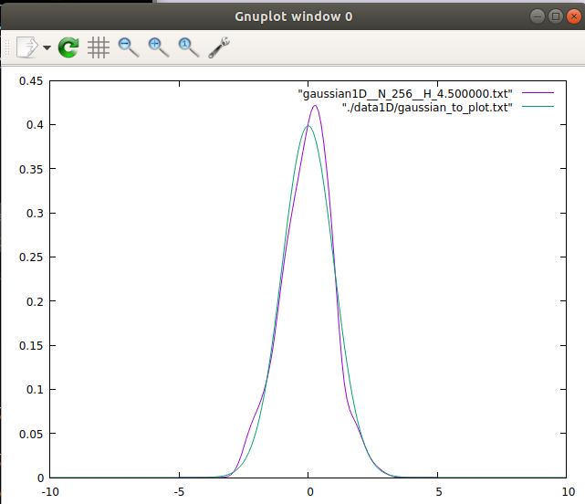

# Parzen Window implementation
Implementation of "Parzen Window" (a non-parametric technique)
for pdf estimation.

## Parzen Window
Assume a training set T, |T| = n.
Each pattern in __T__ is drawn from an unknown pdf p(x) to esimate.
Assume also a ragion __R__ of the features space.

The main formula to consider is:  

* __k__ is the number of patterns inside the region R
* __n__ is the total number of patterns in the training set
* __V__ is the iper-volume of the region R

The main idea of parzen window is to estimate the value of the unknown pdf
in a specific pattern x<sub>0</sub>.
In order to do this we use an helper function: a __window function__ or __kernel__.
The window function used in the implementation was a guassian function.

Parzen window estimates the value of the pdf p() in x<sub>0</sub>, by fixing the
volume of the region and compute, as consequence, the number of patterns
in the volume (tanks to the window function).

The problem is to define the size of the iper-volume; in the implementation
it was used an hypercube with edge __h__:  
  
Where H1 is an input parameter.

The final formula, implemented in the code, is:  
  
Where is easy to see how the parameter __k__ has been replaced by the summation
of window functions for each pattern. In the end the window function was used
to count how many patterns are within the region __R__.

## Compile and run the test (Estimation of gaussian pdf)

```
g++ test_ParzenWindow.cc pdfEstimatorPW.cc utils.cc -o test_ParzenWindow

```
For this test I used a gaussian distribution in 1D and 2D. The following lines explain how to run the tests.
```
# Test 1D
./parzenWindow data1D/gaussian_training_set.txt 1.5 gaussian1D

# Test 2D
./parzenWindow data2D/gaussian_training_set.txt 1.5 gaussian2D
```
Where in each of the line above there are 3 input parameters:
* path to the input data.
* Value of H1 (the initial edge of the window).
* Name of the output file, containing the estimation of the pdf.

### Results
For the test was used a training set of __256 patterns__ drawn from a gaussian
distribution.  
The results are shown in the following picture. The real pdf was drawn in green
and the estimated pdf was drawn in purple.
 __H1 = 1.0__

 __H1 = 3.0__

 __H1 = 4.5__

## IRIS Classifier test
I used the parzen window estimation to exploit the Bayes theorem in order to get a classification of the well known iris dataset.
There is a validation test in order to find out the best H1 to give in input to the parzen window estimator.
For the complilation execute this command:
```
g++ IRIS_Classifier.cc pdfEstimatorPW.cc utils.cc -o IRIS_Classifier
```
For run the test, execute this command:
```
./IRIS_Classifier
```
